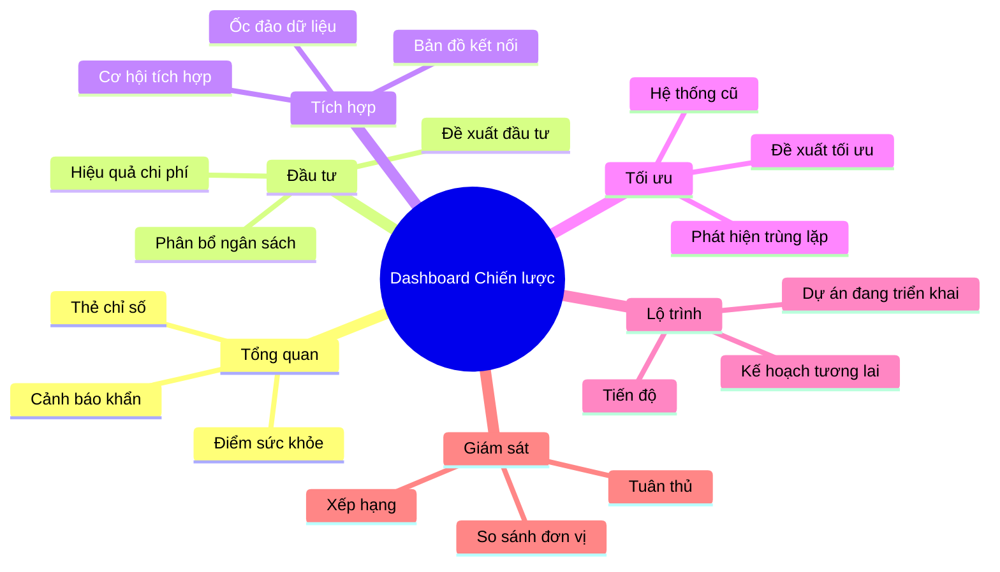
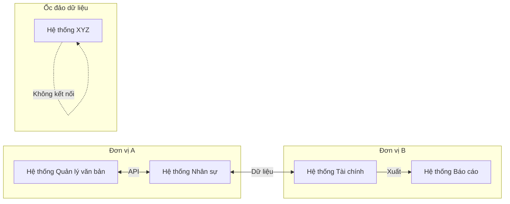
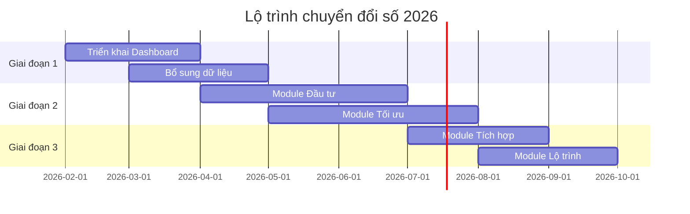
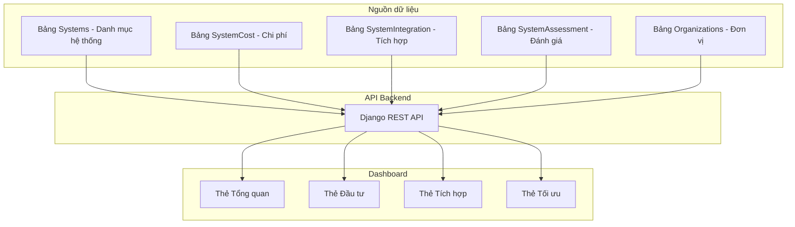

# Mô tả tính năng Dashboard chiến lược CDS

**Dành cho:** Bộ trưởng Bộ Khoa học và Công nghệ
**Ngày:** 26/01/2026
**Phiên bản:** 2.0

---

## Phần 1: Giới thiệu chung

### Dashboard chiến lược là gì?

Dashboard chiến lược CDS là **màn hình tổng hợp thông tin** giúp Bộ trưởng nắm bắt nhanh tình hình công nghệ thông tin của toàn Bộ.

Giống như bảng điều khiển xe hơi cho biết tốc độ, xăng, nhiệt độ máy - Dashboard này cho biết:
- Có bao nhiêu hệ thống đang hoạt động?
- Tiền đầu tư đổ vào đâu?
- Hệ thống nào đang gặp vấn đề?
- Cần làm gì tiếp theo?

### Tại sao cần Dashboard này?

Hiện tại, Bộ KH&CN có **hàng trăm hệ thống phần mềm** phục vụ các đơn vị khác nhau. Nếu không có công cụ tổng hợp, Bộ trưởng sẽ phải:
- Đọc nhiều báo cáo riêng lẻ
- Hỏi nhiều đơn vị để nắm tình hình
- Khó phát hiện vấn đề kịp thời
- Khó ra quyết định đầu tư hợp lý

Dashboard giải quyết tất cả những vấn đề này bằng cách **gom tất cả vào một màn hình duy nhất**.

---

## Phần 2: Các tính năng chính

### Sơ đồ tổng quan cấu trúc

### Thẻ 1: Tổng quan - Nhìn nhanh trong 30 giây

**Mục đích:** Cho Bộ trưởng cái nhìn tổng thể ngay khi mở Dashboard.

**Có gì trên màn hình?**

| Thành phần | Giải thích đơn giản |
|------------|---------------------|
| Điểm sức khỏe tổng thể | Một con số từ 0 đến 100 cho biết tình trạng chung. Trên 80 là tốt, dưới 50 là cần chú ý |
| 4 thẻ chỉ số chính | Tổng số hệ thống, tổng ngân sách, số sự cố, số đơn vị |
| Top 3 việc cần làm | Danh sách 3 việc quan trọng nhất cần Bộ trưởng quyết định |
| Biểu đồ trạng thái | Biểu đồ tròn chia theo: đang hoạt động, đang phát triển, đã dừng |

### Thẻ 2: Đầu tư - Tiền đổ vào đâu?

**Mục đích:** Giúp Bộ trưởng biết ngân sách CNTT được phân bổ như thế nào.

**Có gì trên màn hình?**

| Thành phần | Giải thích đơn giản |
|------------|---------------------|
| Bản đồ phân bổ | Biểu đồ ô vuông, ô nào to hơn thì nhận nhiều tiền hơn |
| Hiệu quả chi phí | So sánh chi phí với số người dùng. Hệ thống nào chi nhiều nhưng ít người dùng? |
| Khoảng cách đầu tư | Đơn vị nào cần được đầu tư thêm? |

### Thẻ 3: Tích hợp - Hệ thống nào kết nối với nhau?

**Mục đích:** Cho thấy các hệ thống đang chia sẻ dữ liệu như thế nào.

**Sơ đồ minh họa kết nối:**

**Có gì trên màn hình?**

| Thành phần | Giải thích đơn giản |
|------------|---------------------|
| Bản đồ mạng lưới | Như sơ đồ trên, cho thấy hệ thống nào nói chuyện với nhau |
| Ốc đảo dữ liệu | Hệ thống nào đang đứng một mình, không chia sẻ với ai |
| Đề xuất tích hợp | Gợi ý hệ thống nào nên kết nối với nhau để tiết kiệm |

### Thẻ 4: Tối ưu - Cái gì thừa, cái gì cũ?

**Mục đích:** Phát hiện cơ hội tiết kiệm và hiện đại hóa.

**Có gì trên màn hình?**

| Thành phần | Giải thích đơn giản |
|------------|---------------------|
| Phát hiện trùng lặp | Hai hệ thống làm cùng một việc - có thể gom lại? |
| Radar công nghệ cũ | Hệ thống nào dùng công nghệ quá cũ, cần nâng cấp? |
| Đề xuất tối ưu | Gợi ý: giữ nguyên, nâng cấp, thay thế, hay gom lại? |
| Mô phỏng tiết kiệm | Nếu làm theo đề xuất thì tiết kiệm được bao nhiêu? |

### Thẻ 5: Lộ trình - Kế hoạch tương lai

**Mục đích:** Theo dõi các dự án đang triển khai và kế hoạch chuyển đổi số.

**Sơ đồ minh họa lộ trình:**

### Thẻ 6: Giám sát - Ai làm tốt?

**Mục đích:** So sánh hiệu quả CNTT giữa các đơn vị.

**Có gì trên màn hình?**

| Thành phần | Giải thích đơn giản |
|------------|---------------------|
| Bảng xếp hạng | Đơn vị nào có điểm cao nhất về CNTT? |
| Biểu đồ radar | So sánh nhiều tiêu chí cùng lúc: chi phí, hiệu quả, tích hợp... |
| Điểm tuân thủ | Đơn vị nào đang vi phạm quy định về bảo mật, báo cáo? |

### Thanh cảnh báo - Luôn hiển thị

Ở cuối màn hình luôn có một thanh cảnh báo cho biết:
- Có mấy vấn đề **nghiêm trọng** cần xử lý ngay (màu đỏ)
- Có mấy vấn đề **cần chú ý** (màu vàng)
- Bấm vào để xem chi tiết

---

## Phần 3: Dữ liệu lấy từ đâu?

### Nguồn dữ liệu

Dashboard lấy dữ liệu từ **hệ thống quản lý CNTT hiện có** của Bộ, bao gồm:

### Dữ liệu đã có sẵn

Hệ thống hiện tại đã thu thập được:
- Thông tin cơ bản của từng hệ thống (tên, mã, đơn vị quản lý, trạng thái)
- Chi phí đầu tư và vận hành (với các hệ thống Level 2)
- Thông tin tích hợp và kết nối API
- Đánh giá và đề xuất từ đơn vị

---

## Phần 4: Dữ liệu hiện có đủ chưa?

### Đánh giá nhanh

| Nhóm tính năng | Đủ dữ liệu chưa? | Cần làm gì? |
|----------------|------------------|-------------|
| Tổng quan | 70% | Thiếu điểm sức khỏe tổng hợp |
| Đầu tư | 60% | Chỉ Level 2 có chi phí |
| Tích hợp | 80% | Khá đầy đủ |
| Tối ưu | 50% | Thiếu phân loại công nghệ |
| Lộ trình | 20% | Chưa có bảng dự án |
| Giám sát | 40% | Thiếu bảng cảnh báo, sự cố |

### Cần bổ sung gì?

**Quan trọng nhất (P0):**
1. **Bảng Cảnh báo** - Để gửi thông báo khi có vấn đề
2. **Bảng Sự cố** - Để theo dõi lịch sử lỗi hệ thống
3. **Trường Điểm sức khỏe** - Để tính điểm tổng hợp cho mỗi hệ thống

**Quan trọng (P1):**
1. **Bảng Dự án** - Để theo dõi lộ trình chuyển đổi số
2. **Bảng Ngân sách theo năm** - Để theo dõi đầu tư theo thời gian
3. **Trường Phân loại công nghệ** - Để phát hiện hệ thống cũ

---

## Phần 5: Lộ trình triển khai đề xuất

### Giai đoạn 1: Nền tảng (4-6 tuần)

Làm được gì: Dashboard cơ bản với dữ liệu hiện có
- Thẻ Tổng quan (thẻ chỉ số, biểu đồ trạng thái)
- Thanh cảnh báo đơn giản
- Bảng so sánh đơn vị

### Giai đoạn 2: Đầu tư và tối ưu (6-8 tuần)

Làm được gì: Phân tích chi phí và phát hiện cơ hội
- Bản đồ phân bổ ngân sách
- Radar hệ thống cũ
- Phát hiện trùng lặp

### Giai đoạn 3: Tích hợp và lộ trình (6-8 tuần)

Làm được gì: Nhìn toàn cảnh kết nối và theo dõi dự án
- Bản đồ mạng lưới tích hợp
- Biểu đồ Gantt dự án
- Phát hiện ốc đảo dữ liệu

### Giai đoạn 4: Nâng cao (8-12 tuần)

Làm được gì: Tính năng thông minh
- Đề xuất tự động từ phân tích dữ liệu
- Mô phỏng kịch bản
- Truy vấn bằng ngôn ngữ tự nhiên

---

## Tóm tắt

Dashboard chiến lược CDS giúp Bộ trưởng:

1. **Nhìn nhanh** - Nắm tình hình trong 30 giây
2. **Phát hiện vấn đề** - Biết ngay cái gì cần xử lý
3. **Ra quyết định** - Có dữ liệu để quyết định đầu tư, tích hợp, tối ưu
4. **Theo dõi tiến độ** - Biết đang đi đến đâu so với kế hoạch

**Thông điệp chính:**

*"Từ DỮ LIỆU đến HIỂU BIẾT, từ HIỂU BIẾT đến QUYẾT ĐỊNH, từ QUYẾT ĐỊNH đến HÀNH ĐỘNG."*
